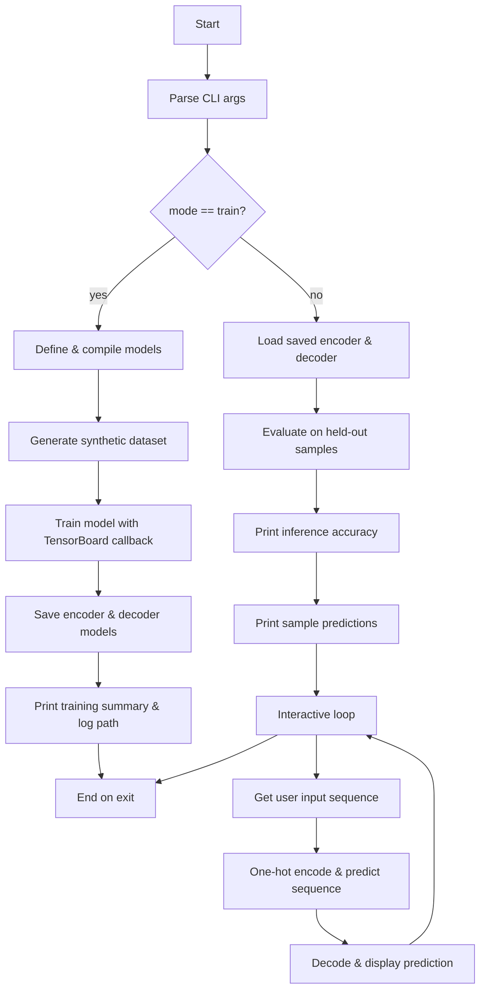

# csu-csc580

Applied Neural Net and Machine Learning course. We will primarily be using
windows and python env for the projects. We will also use Anaconda for managing
python environments and versions because these are research and developement
type activities.

## Prequisites and Setup

* Python 3.12+
* Anaconda

Setup `conda` cli.

```bash

# generic
conda init

# powershell specific
conda init powershell
```

## Usage 

For a list of commands: `make`

### Portfolio Project

#### Flowchart



#### Usage

Setup

```bash
make pp-setup
```

Make sure you are in the `portfolio` conda env.

```bash
conda activate portfolio
```

Train models.

```bash
make pp MODE=train
```

Run inference.

```bash
make pp MODE=infer
```

Run Tensorboard for the model.

```bash
make pp-tensorboard
```

### Milestones

These are Portfolio Project Milestones which are more advance apps.

#### 1 - Facial Recognition

Setup.

```bash
make m1-face-setup
```

Make sure you are in the `m1face` conda env.

```bash
conda activate m1face
```

Execute.

```bash
make m1-face
```

### Basic Facial Recognition App

One time setup.

```bash
make basic-facial-app-setup
```

Make sure you are in the `faceenv` conda env.

```bash
conda activate faceenv
```

Execute the basic facial app.

```bash
make basic-facial-app
```

### Handwritten Digits App

One time setup

```bash
make handwritten-digits-ml-app-setup
```

Make sure you are in the `mnist-tf` conda env.

```bash
conda activate mnist-tf
```

Execute the hand written ml app training

```bash
make handwritten-digits-ml-app-train
```

Execute the hand written ml app inference

```bash
make handwritten-digits-ml-app-infer
```

Execute the learning rate test

```bash
make handwritten-digits-ml-app-lrtest
```

Execute the hidden layers test

```bash
make handwritten-digits-ml-app-ltest
```

Execute the batch size test

```bash
make handwritten-digits-ml-app-btest
```

## Fuel Efficiency

Setup Environment.

```bash
make basic-fuel-efficency-setup
```

Make sure you are in the `fueleff` conda env.

```bash
conda activate fueleff
```

> Supported model: `neural`, `linear`

Execute training.

```bash
# traing using neural model
make basic-fuel-efficency MODE=train MODEL=neural

# traing using linear model
make basic-fuel-efficency MODE=train MODEL=linear
```

Execute trainference.

```bash
make basic-fuel-efficency MODE=infer
```

## Tox21

Setup Environment.

```bash
make tox21-setup
```

Make sure you are in the `tox21` conda env.

```bash
conda activate tox21
```

Execute training mode.

```bash
# traing using neural model
make tox21 MODE=train
```

Visualize model in Tensorboard.

```bash
make tox21-tensorboard
```

Execute inference mode.

```bash
# traing using neural model
make tox21 MODE=infer
```

## Iris Random Forest Classifier

Setup Environment.

```bash
make irisrf-setup
```

Make sure you are in the `iris_rf` conda env.

```bash
conda activate iris_rf
```

Execute training mode.

```bash
make irisrf MODE=train
```

Execute inference mode.

```bash
make irisrf MODE=infer
```

## CIFAR Classification

Setup Environment.

```bash
make cifar-setup
```

Make sure you are in the `cifar-cnn` conda env.

```bash
conda activate cifar-cnn
```

Execute training mode.

```bash
make cifar MODE=train
```

Execute inference mode.

```bash
make cifar MODE=infer
```

Start Tensorboard for CIFAR.

```bash
make cifar-tensorboard
```